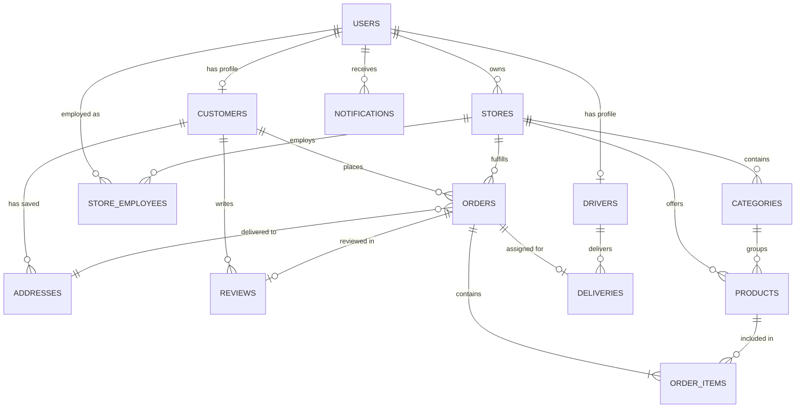

# 📚 التوثيق الشامل للـ Backend - مشروع WASel (واصل)

مشروع **WASel** هو منصة توصيل طلبات ومأكولات متكاملة (Multi-Vendor On-Demand Delivery Platform) مبنية بأحدث معايير هندسة البرمجيات باستخدام **Spring Boot 3** و **Java 21**.

---

## 📑 فهرس المحتويات
1. [نظرة عامة والتقنيات المستخدمة (Tech Stack)](#1-نظرة-عامة-والتقنيات-المستخدمة)
2. [الهيكل المعماري للنظام (Architecture)](#2-الهيكل-المعماري-للنظام)
3. [مخطط قاعدة البيانات والكيانات (Database Schema & Entities)](#3-مخطط-قاعدة-البيانات-والكيانات)
4. [حالات النظام والـ Enums (State Machines & Enums)](#4-حالات-النظام-والـ-enums)
5. [الأمان والمصادقة (Spring Security & JWT)](#5-الأمان-والمصادقة)
6. [شرح تفصيلي لكل الكلاسات (Classes Breakdown)](#6-شرح-تفصيلي-لكل-الكلاسات)
   - [حزمة الإعدادات (Config Package)](#61-حزمة-الإعدادات-comwaselconfig)
   - [حزمة الكيانات (Entity Package)](#62-حزمة-الكيانات-comwaselentity)
   - [حزمة المستودعات (Repository Package)](#63-حزمة-المستودعات-comwaselrepository)
   - [حزمة الخدمات والمنطق البرمجي (Service Package)](#64-حزمة-الخدمات-comwaselservice)
   - [حزمة المتحكمات ونقاط النهاية (Controller Package)](#65-حزمة-المتحكمات-comwaselcontroller)
   - [حزمة معالجة الأخطاء (Exception Package)](#66-حزمة-معالجة-الأخطاء-comwaselexception)
   - [حزمة كائنات نقل البيانات (DTO Package)](#67-حزمة-كائنات-نقل-البيانات-comwaseldto)
7. [جدول نقاط النهاية الكامل (API Endpoints Reference)](#7-جدول-نقاط-النهاية-الكامل-api-endpoints)
8. [دورة حياة الطلب والإشعارات (Order Lifecycle & Notifications)](#8-دورة-حياة-الطلب-والإشعارات)
9. [طريقة التشغيل وقواعد البيانات (Run & Configuration)](#9-طريقة-التشغيل-وقواعد-البيانات)

---

## 1. نظرة عامة والتقنيات المستخدمة

- **لغة البرمجة:** Java 21 LTS
- **إطار العمل الأساسي:** Spring Boot 3.3.x
- **الأمان:** Spring Security 6 + JSON Web Tokens (JJWT 0.12.5)
- **قاعدة البيانات:** H2 Database (File-Persistent Engine في `./data/waseldb`)
- **الوصول للبيانات:** Spring Data JPA / Hibernate ORM
- **التوثيق التفاعلي:** Springdoc OpenAPI / Swagger UI 3
- **التحقق من صحة البيانات:** Jakarta Validation API (Hibernate Validator)
- **الأدوات المساعدة:** Project Lombok

---

## 2. الهيكل المعماري للنظام

يعتمد المشروع على معمارية الطبقات القياسية (**Layered Architecture / Clean Architecture**):

```
                       [ Client Applications (Web / Mobile) ]
                                         │
                                         ▼ (HTTP / JSON)
                       [ Controller Layer (REST Endpoints) ]
                                         │
                                         ▼ (DTOs & Validation)
                       [ Service Layer (Business Logic & Transactions) ]
                                         │
                                         ▼ (Entities)
                       [ Repository Layer (Spring Data JPA / SQL) ]
                                         │
                                         ▼
                       [ Database Engine (H2 / PostgreSQL / MySQL) ]
```

---

## 3. مخطط قاعدة البيانات والكيانات



---

## 4. حالات النظام والـ Enums

تحتوي الحزمة `com.wasel.enums` على 6 أنواع تعدادية لضبط دورات العمل:

### 1. `UserRole`
- `CUSTOMER`: عميل (طلب وجبات ومنتجات، إضافة عناوين، تقييم).
- `STORE_OWNER`: صاحب متجر (إدارة المتاجر والمنتجات وقبول الطلبات وتجهيزها).
- `STORE_EMPLOYEE`: موظف متجر (متابعة الطلبات وتجهيزها).
- `DRIVER`: كابتن توصيل (رادار الطلبات الجاهزة، استلام، توصيل، تحصيل أرباح).
- `ADMIN`: مسؤول النظام (لوحة تحكم إحصائية، رقابة المستخدمين والمتاجر).

### 2. `OrderStatus` (دورة حياة الطلب من 8 مراحل)
- `PENDING`: تم إنشاء الطلب من العميل وبانتظار قبول المتجر.
- `ACCEPTED`: تم قبول الطلب من إدارة المتجر.
- `PREPARING`: جاري طهي وتجهيز الطلب في المطبخ.
- `READY`: تم تجهيز الطلب بالكامل ومتاح في رادار السائقين.
- `ASSIGNED`: قبل أحد السائقين مهمة التوصيل وهو في طريقه للمتجر.
- `PICKED_UP`: استلم السائق الطلب من المتجر وانطلق به.
- `ON_THE_WAY`: السائق في الطريق إلى عنوان العميل.
- `DELIVERED`: تم تسليم الطلب للعميل بنجاح وتمت المحاسبة.
- `CANCELLED`: تم إلغاء الطلب من العميل أو المتجر.
- `REJECTED`: تم رفض الطلب من المتجر مع ذكر السبب.

### 3. `DeliveryStatus`
- `PENDING` ➔ `ASSIGNED` ➔ `PICKED_UP` ➔ `ON_THE_WAY` ➔ `DELIVERED` / `CANCELLED`.

### 4. `DriverStatus`
- `AVAILABLE`: متاح للعمل واستقبال إشعارات الرادار.
- `BUSY`: في مهمة توصيل جارية.
- `UNAVAILABLE`: غير متصل / غير متاح للعمل.

### 5. `StoreStatus`
- `OPEN`: المتجر مفتوح ويستقبل طلبات الزبائن.
- `CLOSED`: المتجر مغلق مؤقتاً.

### 6. `NotificationType`
- `ORDER_CREATED`, `ORDER_ACCEPTED`, `ORDER_REJECTED`, `ORDER_PREPARING`, `ORDER_READY`, `DRIVER_ASSIGNED`, `ORDER_PICKED_UP`, `ORDER_ON_THE_WAY`, `ORDER_DELIVERED`, `ORDER_CANCELLED`, `REVIEW_RECEIVED`.

---

## 5. الأمان والمصادقة

- **نمط الأمان:** Stateless Token-Based Authentication باستخدام **JWT**.
- **تشفير كلمات المرور:** `BCryptPasswordEncoder` بقوة تجزئة عالية.
- **تكوين CORS:** يدعم كافة الطلبات الصادرة من واجهة React (`http://localhost:5173`) بكافة الـ Headers و HTTP Methods (`GET, POST, PUT, PATCH, DELETE, OPTIONS`).

---

## 6. شرح تفصيلي لكل الكلاسات

### 6.1 حزمة الإعدادات (`com.wasel.config`)

| الكلاس | الوصف والمسؤولية |
| :--- | :--- |
| **`SecurityConfig`** | تكوين سلاسل فلاتر أمان Spring Security (`SecurityFilterChain`). يحدد المسارات العامة (`/api/auth/**`, `/swagger-ui/**`, `/h2-console/**`) والمسارات المحمية بحسب الأدوار، ويعطل حماية CSRF لـ REST APIs، ويفعل إعدادات CORS و H2 Console Headers. |
| **`JwtAuthenticationFilter`** | فلتر مخصص يعترض كل طلب HTTP وارد، ويستخرج ترويسة `Authorization: Bearer <token>`، ويتحقق من صحة التوكن عبر `JwtService`، ثم يضبط سياق الأمان `SecurityContextHolder`. |
| **`ApplicationConfig`** | يوفر كائنات Spring Beans الأساسية: `UserDetailsService` للبحث عن المستخدمين بالبريد، `PasswordEncoder` (BCrypt)، و `AuthenticationManager`. |
| **`OpenApiConfig`** | تكوين توثيق الـ Swagger / OpenAPI 3 مع إضافة مخطط الأمان `bearerAuth` للـ JWT ليتمكن المطور من تجربة الـ Endpoints المحمية مباشرة من المتصفح. |

---

### 6.2 حزمة الكيانات (`com.wasel.entity`)

| الكيان (Entity) | الجدول في DB | الوصف والعلاقات |
| :--- | :--- | :--- |
| **`User`** | `users` | يمثل حساب المستخدم الأساسي (الاسم، البريد، كلمة المرور المشفرة، الهاتف، الدور `UserRole`، وحالة التفعيل `isActive`). |
| **`Customer`** | `customers` | ملف العميل الشخصي المرتبط بعلاقة `OneToOne` مع جدول `users`. |
| **`Driver`** | `drivers` | ملف كابتن التوصيل المرتبط بـ `User`، ويحتوي على حالة السائق `DriverStatus` ومتوسط التقييم `rating`. |
| **`Store`** | `stores` | بيانات المتجر (الاسم، الوصف، الهاتف، العنوان، رسوم التوصيل `deliveryFee`، التقييم، الحالة `StoreStatus`، ومالك المتجر `owner`). |
| **`StoreEmployee`** | `store_employees` | ربط الموظفين بالمتاجر التي يعملون بها مع تحديد الصلاحيات الوظيفية. |
| **`Category`** | `categories` | تصنيفات قائمة الطعام/المنتجات التابعة لكل متجر (مثل: بيتزا، مقبلات، مشروبات). |
| **`Product`** | `products` | تفاصيل المنتج (الاسم، الوصف، السعر `BigDecimal`، حالة التوفر `isAvailable`، رابط الصورة، والتصنيف التابع له). |
| **`Address`** | `addresses` | عناوين التوصيل المسجلة للعملاء (تسمية العنوان `label`، العنوان التفصيلي `addressLine`، المدينة `city`، رقم المبنى، الدور، الشقة، وملاحظات التوصيل). |
| **`Order`** | `orders` | سجل الطلب الرئيسي (رقم الطلب الفريد `orderNumber`، العميل، المتجر، العنوان، الإجمالي، رسوم التوصيل، الملاحظات، الحالة `OrderStatus`، وسبب الإلغاء/الرفض). |
| **`OrderItem`** | `order_items` | أصناف الطلب الفردية (المنتج، الكمية، السعر عند الشراء `unitPrice`، والإجمالي الفرعي). |
| **`Delivery`** | `deliveries` | مهمة التوصيل المرتبطة بالطلب والسائق المعين، وتوقيتات الاستلام والتوصيل وحالة المهمة `DeliveryStatus`. |
| **`Review`** | `reviews` | تقييم الطلب (تقييم المتجر من 1-5، تقييم السائق من 1-5، وتعليق العميل). |
| **`Notification`** | `notifications` | إشعارات النظام الموجهة للمستخدمين مع تتبع حالة القراءة `isRead` ونوع الإشعار `NotificationType`. |

---

### 6.3 حزمة المستودعات (`com.wasel.repository`)

تعتمد جميع المستودعات على `JpaRepository<Entity, ID>` وتتضمن دوال استعلام مخصصة:

- **`UserRepository`**: دوال البحث `findByEmail` و `existsByEmail` و `existsByPhone`.
- **`StoreRepository`**: البحث عن المتاجر المفتوحة `findByStatus(StoreStatus.OPEN)`، ومتاجر مالك محدد `findByOwnerId`.
- **`CategoryRepository`**: جلب تصنيفات متجر مرتبة `findByStoreIdOrderByDisplayOrderAsc`.
- **`ProductRepository`**: جلب منتجات متجر `findByStoreId`، والمنتجات المتاحة بتصنيف معين `findByCategoryIdAndIsAvailableTrue`.
- **`AddressRepository`**: جلب عناوين عميل `findByCustomerId`.
- **`OrderRepository`**: جلب طلبات عميل `findByCustomerIdOrderByCreatedAtDesc`، طلبات متجر `findByStoreIdOrderByCreatedAtDesc`، والبحث برقم الطلب `findByOrderNumber`.
- **`DeliveryRepository`**: جلب الطلبات المتاحة للرادار `findByStatus(DeliveryStatus.PENDING)`، ومهمات سائق معين `findByDriverIdOrderByCreatedAtDesc`.
- **`ReviewRepository`**: استعلامات JPQL لحساب متوسط تقييم المتجر `getAverageStoreRating` ومتوسط تقييم السائق `getAverageDriverRating`.
- **`NotificationRepository`**: جلب إشعارات المستخدم `findByUserIdOrderByCreatedAtDesc`، وحساب الإشعارات غير المقروءة `countByUserIdAndIsReadFalse`.

---

### 6.4 حزمة الخدمات والمنطق البرمجي (`com.wasel.service`)

| الخدمة (Service) | الوظائف والمنطق البرمجي |
| :--- | :--- |
| **`AuthService`** | إدارة تسجيل الدخول وإنشاء الحسابات الجديدة وتشفير كلمات المرور وإنشاء ملفات الأدوار (`Customer`, `Driver`) تلقائياً وإصدار توكن JWT. |
| **`JwtService`** | توليد وفك تشفير والتحقق من صلاحية وتاريخ انتهاء توكنات JWT مع تضمين بيانات المستخدم والصلاحيات (`Claims`). |
| **`UserService`** | إدارة بيانات المستخدمين وتعديل الملف الشخصي والتحقق من الصلاحيات. |
| **`StoreService`** | إنشاء وتحديث المتاجر، فتح وإغلاق المتجر، والتحقق من ملكية وصلاحيات صاحب المتجر على متجره. |
| **`ProductService`** | إضافة وتعديل وحذف المنتجات، تبديل حالة توفر المنتج (`toggleAvailability`)، والتحقق من تبعية المنتج للمتجر. |
| **`CategoryService`** | إنشاء وتعديل وحذف تصنيفات المنيو وترتيب عرضها داخل المتجر. |
| **`AddressService`** | حفظ وتحديث وحذف عناوين التوصيل الخاصة بالعميل مع التحقق من صحة الحقول. |
| **`OrderService`** | المنطق الشامل لدورة حياة الطلب: إنشاء الطلب والتحقق من توفر المنتجات وحساب الإجمالي ورسوم التوصيل، قبول ورفض وبدء تحضير وتجهيز الطلب، إلغاء وإعادة الطلب (`reorder`)، وإرسال الإشعارات الفورية لكافة الأطراف. |
| **`DeliveryService`** | محرك رادار السائقين وتوزيع الطلبات: استعراض الطلبات المتاحة، قبول التوصيل، تأكيد الاستلام من المتجر (`pickup`)، بدء رحلة التوصيل (`on-the-way`)، إتمام التسليم (`delivered`) وتحديث رصيد السائق وإرسال الإشعارات. |
| **`ReviewService`** | تسجيل تقييمات العملاء للمتاجر والسائقين، حساب المتوسط الحسابي للتقييمات وتحديثها في جداول `stores` و `drivers`، وإشعار المتجر والسائق بالتقييم الجديد. |
| **`NotificationService`** | إرسال الإشعارات لكافة المستخدمين، جلب إشعارات المستخدم، حساب غير المقروء، وتحديد الإشعارات كمقروءة (`markAsRead` / `markAllAsRead`). |
| **`AdminService`** | جمع إحصائيات لوحة التحكم المركزية (إجمالي المبيعات، عدد المتاجر، العملاء، السائقين، والطلبات)، وتفعيل وتعطيل حسابات المستخدمين. |
| **`CustomerService`** | إدارة ملف العميل وجلب معلوماته وتحديثها. |
| **`DriverService`** | إدارة ملف السائق وتحديث حالته بين متاح (`AVAILABLE`) ومشغول (`BUSY`). |
| **`StoreEmployeeService`** | إدارة موظفي المتاجر وصلاحياتهم. |

---

### 6.5 حزمة المتحكمات ونقاط النهاية (`com.wasel.controller`)

| المتحكم (Controller) | المسار الأساسي | الوصف |
| :--- | :--- | :--- |
| **`AuthController`** | `/api/auth` | تسجيل الدخول (`/login`)، وإنشاء الحسابات (`/register`). |
| **`StoreController`** | `/api/stores` | تصفح المتاجر المفتوحة، جلب متجر بالمعرف، إدارة متاجر المالك، وإنشاء وتعديل المتجر وتحديث حالته. |
| **`ProductController`** | `/api/stores/{storeId}/products` | جلب وإضافة وتعديل وحذف المنتجات وتبديل حالة توفرها. |
| **`CategoryController`** | `/api/stores/{storeId}/categories` | جلب وإضافة وتعديل وحذف تصنيفات المنيو. |
| **`OrderController`** | `/api/orders` | إنشاء الطلب، طلباتي، طلبات المتجر، تفاصيل الطلب، قبول، رفض، تحضير، جاهز، إلغاء، وإعادة الطلب. |
| **`DeliveryController`** | `/api/deliveries` | رادار الطلبات المتاحة، توصيلاتي، قبول التوصيل، استلام، انطلاق، وإتمام التوصيل. |
| **`AddressController`** | `/api/addresses` | جلب وحفظ وتعديل وحذف عناوين التوصيل للعميل المسجل. |
| **`ReviewController`** | `/api/reviews` | إضافة تقييم للطلب، جلب تقييم الطلب، وتقييمات المتجر. |
| **`NotificationController`** | `/api/notifications` | جلب الإشعارات، العداد غير المقروء، وتحديد الإشعار كمقروء. |
| **`DriverController`** | `/api/drivers` | جلب ملف السائق وتحديث حالته (متاح / مشغول). |
| **`CustomerController`** | `/api/customers` | جلب وتحديث ملف العميل. |
| **`AdminController`** | `/api/admin` | لوحة المؤشرات، تصفح كافة المتاجر والمستخدمين والطلبات، وتعطيل/تفعيل الحسابات. |

---

### 6.6 حزمة معالجة الأخطاء (`com.wasel.exception`)

تستخدم المنصة أسلوب المعالجة المركزية للأخطاء عبر `@RestControllerAdvice`:

- **`GlobalExceptionHandler`**: يعترض جميع الاستثناءات في التطبيق ويقوم بتحويلها إلى استجابة موحدة من نوع `ErrorResponse` مع كود الحالة المناسب (HTTP Status Code) وتفاصيل الخطأ والوقت.
- **`ResourceNotFoundException`** (404 Not Found): عند عدم العثور على مورد (طلب، متجر، منتج، عنوان).
- **`BadRequestException`** (400 Bad Request): عند وجود خطأ في البيانات أو مخالفة لقواعد دورة العمل.
- **`UnauthorizedException`** (401 Unauthorized): عند فشل تسجيل الدخول أو عدم وجود توكن صالح.
- **`ForbiddenException`** (403 Forbidden): عند محاولة الوصول لمورد لا يملكه المستخدم.
- **`DuplicateResourceException`** (409 Conflict): عند تكرار بريد إلكتروني، هاتف، أو تقييم طلب تم تقييمه مسبقاً.
- **`ErrorResponse`**: كائن موحد يحتوي على `timestamp`, `status`, `error`, `message`, و `path`.

---

## 7. جدول نقاط النهاية الكامل (API Endpoints)

| Method | Endpoint Path | الدور المطلوب | الوصف |
| :--- | :--- | :--- | :--- |
| **POST** | `/api/auth/register` | عام (Public) | إنشاء حساب جديد (عميل / صاحب متجر / سائق) |
| **POST** | `/api/auth/login` | عام (Public) | تسجيل الدخول واستلام JWT Token |
| **GET** | `/api/stores` | عام (Public) | جلب قائمة المتاجر المفتوحة والمتاحة للتوصيل |
| **GET** | `/api/stores/{id}` | عام (Public) | جلب تفاصيل متجر معين |
| **GET** | `/api/stores/{storeId}/products` | عام (Public) | جلب قائمة منتجات المتجر |
| **GET** | `/api/stores/{storeId}/categories` | عام (Public) | جلب تصنيفات المنيو للمتجر |
| **GET** | `/api/stores/my-stores` | `STORE_OWNER` | جلب المتاجر المملوكة لصاحب المتجر المسجل |
| **POST** | `/api/stores` | `STORE_OWNER` | إنشاء متجر جديد |
| **PUT** | `/api/stores/{id}` | `STORE_OWNER` | تعديل بيانات المتجر ورسوم التوصيل |
| **PATCH**| `/api/stores/{id}/status` | `STORE_OWNER` | فتح أو إغلاق المتجر مؤقتاً |
| **POST** | `/api/stores/{storeId}/products` | `STORE_OWNER` | إضافة منتج جديد لقائمة المنيو |
| **PUT** | `/api/stores/{storeId}/products/{id}` | `STORE_OWNER` | تعديل سعر أو بيانات منتج |
| **PATCH**| `/api/stores/{storeId}/products/{id}/availability` | `STORE_OWNER` | تبديل حالة توفر المنتج (متوفر / غير متوفر) |
| **DELETE**| `/api/stores/{storeId}/products/{id}` | `STORE_OWNER` | حذف منتج من القائمة |
| **POST** | `/api/stores/{storeId}/categories` | `STORE_OWNER` | إضافة تصنيف منيو جديد |
| **POST** | `/api/orders` | `CUSTOMER` | إنشاء وتأكيد طلب جديد |
| **GET** | `/api/orders/my-orders` | `CUSTOMER` | جلب سجل ومتابعة طلبات العميل الحالية |
| **GET** | `/api/orders/store-orders/{storeId}` | `STORE_OWNER` | جلب الطلبات الواردة لمتجر معين |
| **GET** | `/api/orders/{id}` | مصادق عليه | جلب تفاصيل طلب محدد |
| **PATCH**| `/api/orders/{id}/accept` | `STORE_OWNER` | قبول الطلب الوارد |
| **PATCH**| `/api/orders/{id}/reject` | `STORE_OWNER` | رفض الطلب مع توضيح السبب |
| **PATCH**| `/api/orders/{id}/prepare` | `STORE_OWNER` | بدء طهي وتحضير الطلب في المطبخ |
| **PATCH**| `/api/orders/{id}/ready` | `STORE_OWNER` | تعيين الطلب كـ "جاهز" وإطلاقه في رادار السائقين |
| **POST** | `/api/orders/{id}/cancel` | `CUSTOMER`, `STORE_OWNER` | إلغاء الطلب مع توضيح السبب |
| **POST** | `/api/orders/{id}/reorder` | `CUSTOMER` | إعادة إنشاء نفس الطلب السابق بضغطة زر |
| **GET** | `/api/deliveries/available` | `DRIVER` | رادار الطلبات الجاهزة للاستلام والمتاحة للتوصيل |
| **GET** | `/api/deliveries/my-deliveries` | `DRIVER` | سجل توصيلات السائق ومهمته النشطة وأرباحه |
| **PATCH**| `/api/deliveries/{id}/accept` | `DRIVER` | قبول السائق لمهمة التوصيل |
| **PATCH**| `/api/deliveries/{id}/pickup` | `DRIVER` | تأكيد استلام السائق للطلب من المتجر |
| **PATCH**| `/api/deliveries/{id}/on-the-way` | `DRIVER` | بدء انطلاق السائق في الطريق لعنوان العميل |
| **PATCH**| `/api/deliveries/{id}/deliver` | `DRIVER` | إتمام تسليم الطلب للعميل بنجاح وإيداع الأرباح |
| **GET** | `/api/addresses` | `CUSTOMER` | جلب العناوين المسجلة للعميل |
| **POST** | `/api/addresses` | `CUSTOMER` | إضافة عنوان توصيل جديد |
| **PUT** | `/api/addresses/{id}` | `CUSTOMER` | تعديل عنوان توصيل مسجل |
| **DELETE**| `/api/addresses/{id}` | `CUSTOMER` | حذف عنوان توصيل |
| **POST** | `/api/reviews` | `CUSTOMER` | تقييم الطلب والمتجر والسائق بعد التسليم |
| **GET** | `/api/notifications` | مصادق عليه | جلب إشعارات المستخدم الحالية |
| **GET** | `/api/notifications/unread-count` | مصادق عليه | جلب عدد الإشعارات غير المقروءة |
| **PATCH**| `/api/notifications/{id}/read` | مصادق عليه | تحديد إشعار معين كمقروء |
| **PATCH**| `/api/notifications/read-all` | مصادق عليه | تحديد جميع الإشعارات كمقروءة |
| **GET** | `/api/admin/dashboard` | `ADMIN` | جلب إحصائيات ومنظومة مؤشرات الأداء للوحة الإدارة |
| **PATCH**| `/api/admin/users/{userId}/toggle-active` | `ADMIN` | تفعيل أو تعطيل حساب مستخدم |

---

## 8. دورة حياة الطلب والإشعارات

```
[1. Customer: Create Order]
     │
     ├──► إشعار للمتجر (طلب جديد #WS-xxx)
     └──► إشعار للعميل (تم إرسال الطلب بنجاح)
     │
[2. Store Owner: Accept Order]
     │
     └──► إشعار للعميل (قبل المتجر طلبك)
     │
[3. Store Owner: Start Preparing]
     │
     └──► إشعار للعميل (بدأ المطبخ في تحضير وجبتك 🍳)
     │
[4. Store Owner: Mark Ready]
     │
     ├──► إشعار للعميل (طلبك جاهز وبانتظار السائق 📦)
     └──► يظهر الطلب في رادار السائقين (Delivery Radar)
     │
[5. Driver: Accept Delivery]
     │
     ├──► إشعار للعميل (تم إسناد الكابتن فلان 🛵)
     └──► إشعار للمتجر (الكابتن فلان في طريقه للاستلام)
     │
[6. Driver: Pickup Order]
     │
     ├──► إشعار للعميل (استلم الكابتن طلبك من المتجر 📦)
     └──► إشعار للمتجر (تم تسليم الطلب للكابتن)
     │
[7. Driver: On The Way]
     │
     └──► إشعار للعميل (الكابتن في الطريق إلى موقعك 🚀)
     │
[8. Driver: Deliver Order]
     │
     ├──► إشعار للعميل (تم التوصيل بنجاح! بالهناء والشفاء 🎉)
     ├──► إشعار للمتجر (تم تسليم الطلب للعميل)
     └──► إشعار للسائق (تم إيداع أرباح التوصيل في محفظتك 💰)
     │
[9. Customer: Submit Review]
     │
     ├──► إشعار للمتجر (تقييم جديد ⭐ من العميل)
     └──► إشعار للسائق (تقييم جديد ⭐ على التوصيل)
```

---

## 9. طريقة التشغيل وقواعد البيانات

### 1. إعدادات الاتصال بقاعدة البيانات (`application.properties`):
```properties
spring.datasource.url=jdbc:h2:file:./data/waseldb;AUTO_SERVER=TRUE;DB_CLOSE_DELAY=-1
spring.datasource.driverClassName=org.h2.Driver
spring.datasource.username=sa
spring.datasource.password=
spring.jpa.hibernate.ddl-auto=update
spring.jpa.show-sql=true
```

### 2. تشغيل الـ Backend من سطر الأوامر (PowerShell):
```powershell
cd C:\Users\User\Desktop\WASel
.\mvnw.cmd spring-boot:run
```

### 3. روابط الوصول السريع:
- 📄 **توثيق Swagger UI التفاعلي:** `http://localhost:8080/swagger-ui/index.html`
- 🗄️ **لوحة تحكم قاعدة البيانات H2 Console:** `http://localhost:8080/h2-console`
  - *JDBC URL:* `jdbc:h2:file:./data/waseldb;AUTO_SERVER=TRUE`
  - *User:* `sa` *(بدون كلمة مرور)*
